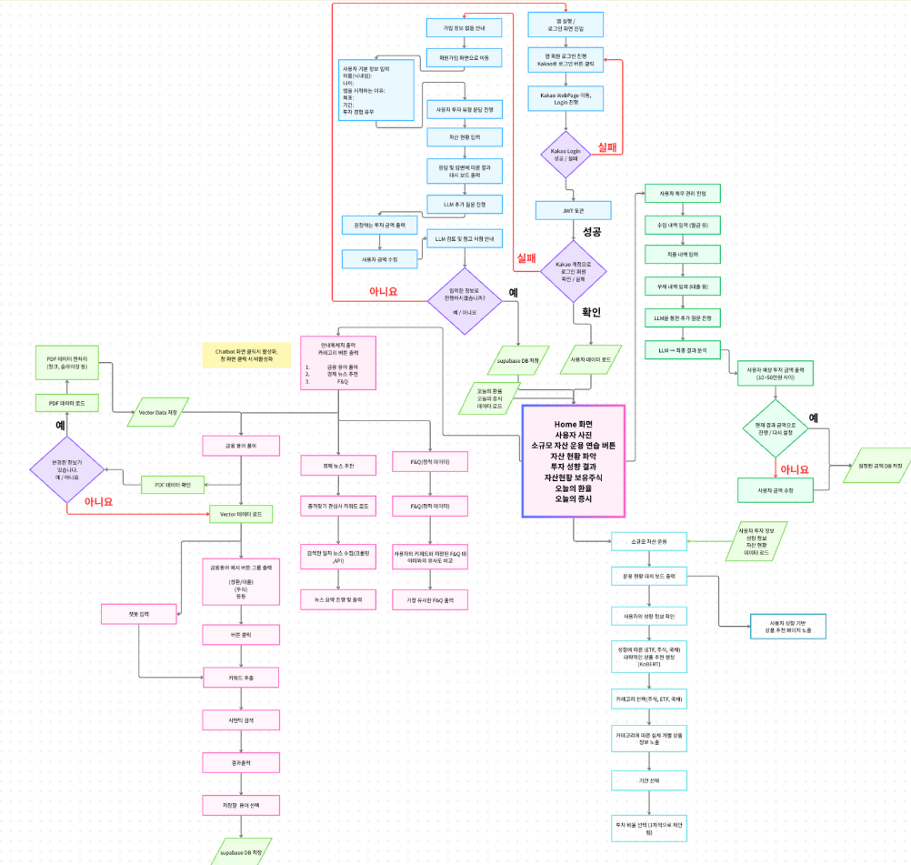
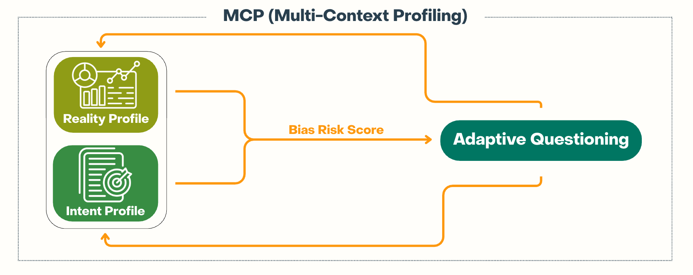
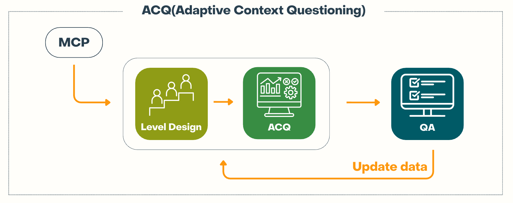
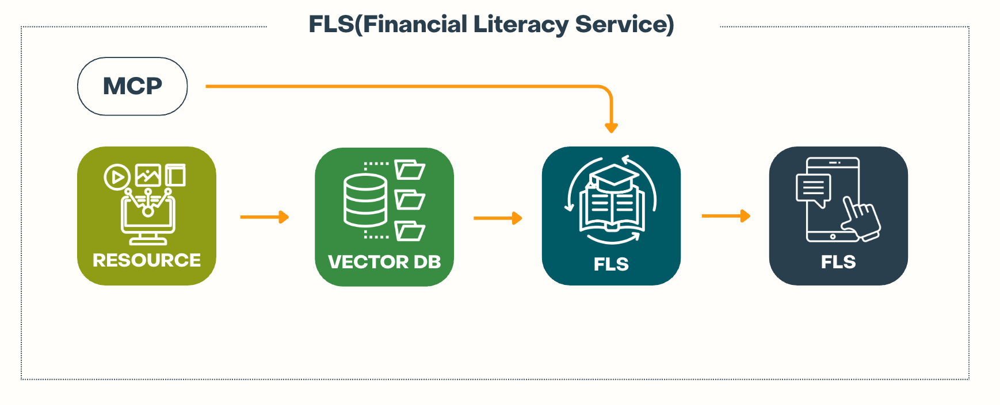
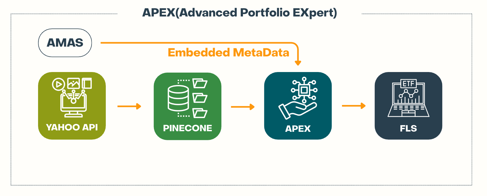
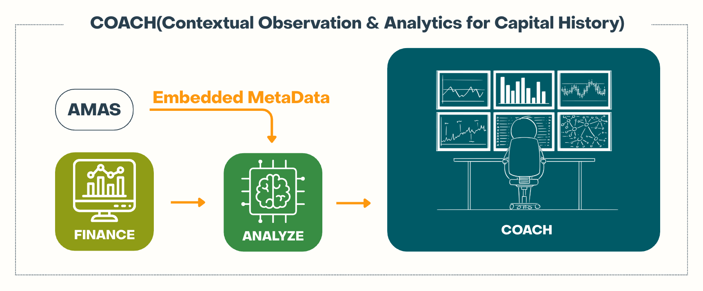
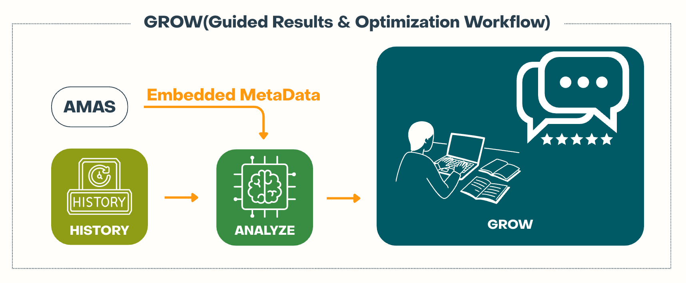
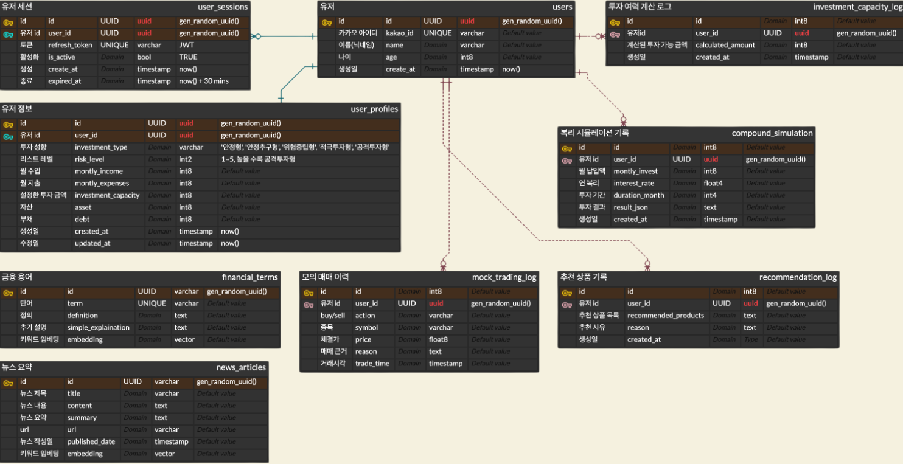
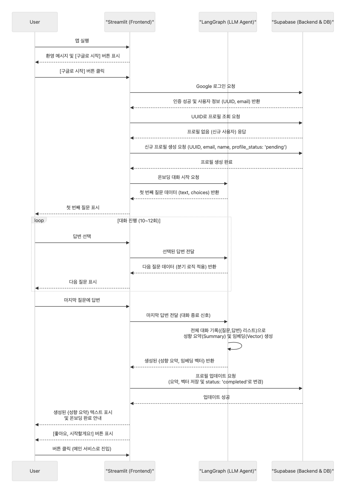

<p align="center">
  
</p>

# FireGenerators – 2030 세대를 위한 금융 지식 학습 및 투자 코칭 어플리케이션

2030 세대가 자신의 **투자 성향**과 **금융 지식 수준**을 진단하고, 맞춤형 학습과 추천, 보유 종목 코칭까지 받을 수 있는 **AI 기반 금융 코치 플랫폼**입니다.
**학습 → 진단 → 추천 → 코칭 → 모니터링**으로 이어지는 일관된 여정을 통해 기초 지식 부족과 비체계적 투자 문제를 해결합니다.


## 주요 기능

1. **사용자 메타 분석** – 투자 목표/기간, 위험 선호, 감정 성향(신중·불안·아쉬움·욕심·자신감·혼란) 진단
2. **금융 레벨 테스트** – OX/객관식 적응형 퀴즈(초·중·고 레벨) + **AI 3문장 요약**
3. **맞춤형 금융 지식** – 관심사(ETF/연금/부동산/FIRE 등) 카드 큐레이션 + 출처 명시
4. **주식·ETF 추천** – 성향/목표/기간 기반 **포트폴리오 제안** 및 리밸런싱 시그널
5. **보유주식 AI 코칭** – 리스크 요인, 대체 종목, **행동 체크리스트** 제안
6. **관심 종목 분석** – 뉴스/공시/기술·기초지표 요약, 트리거·레드 플래그 도출

 

## 1. 프로젝트 소개

### 1.1. 개발 배경 및 필요성

* **투자 참여 확대**: 2030 세대의 투자 경험은 증가했지만, 체계적 학습/코칭의 부재로 단기 손실이 빈번.
* **개인화 학습 공백**: 정보는 넘치나, **개인 수준/관심사/성향**을 반영한 큐레이션 부족.
* **AI 활용 보편화**: LLM/RAG/임베딩 기술 확산 → **설명 가능한 코칭**과 **맞춤 학습** 결합의 적기.

> 결론: **금융 학습 + 진단 + 추천 + 코칭**을 하나의 여정으로 통합하는 서비스가 필요.

### 1.2. 서비스 미션
* 지금 나의 **지식/성향/보유자산**을 파악하고,
* 나에게 맞는 **학습·추천·코칭**을 통해
* **지속 가능한 장기 투자 습관**을 만든다.

### 1.3. 타깃 사용자

* **투자 입문/초중급(2030)**, **성향 중심 투자자**, **자기 주도 학습 의지가 있는 사용자**

### 1.4. 차별성(Why FireGenerators)

* **루프 설계**: 학습 → 테스트 → 추천 → 코칭 → 피드백(알림/리밸런싱)
* **설명 가능성**: 추천/코칭에 **근거/대안/행동**을 함께 제공
* **신뢰 강화**: 지식 카드 **출처 표기**, 요약 기준 일관화, 과신 경계 UX

### 1.5. 사회적 가치/윤리

* **금융 리터러시 제고**와 **위험 인지** 강화
* **개인정보 최소 수집·암호화**, **투자 자문 아님** 고지, **편향/환상 방지 가이드** 적용

 

## 2. 상세 설계

### 2.1. 시스템 구성도

- ui 워크플로우


- 사용자 메타 분석


- 금융 레벨 테스트


- 맞춤형 금융 지식


- 주식·ETF 추천

- 보유주식 AI 코칭


- 관심 종목 분석


### 2.2. 사용 기술

* **Frontend**: Streamlit, Custom CSS
* **Backend**: FastAPI(Python)
* **Database**: Supabase (PostgreSQL + Vector DB) , pinecone
* **AI/ML**: GPT-5, Gemini, KoBERT, Upstage Embeddings(임베딩/RAG)
* **DevOps**: GitHub Actions

### 2.3. ERD 다이어그램 (Mermaid 초안)



```mermaid
```

## 3. 개발 결과

### 3.1. 시퀀스 다이어그램

```Mermaid
sequenceDiagram
    participant User
    participant Streamlit as "Streamlit (Frontend)"
    participant LangGraph as "LangGraph (LLM Agent)"
    participant Supabase as "Supabase (Backend & DB)"

    %% 1. 앱 시작 및 로그인
    User->>Streamlit: 앱 실행
    Streamlit-->>User: 환영 메시지 및 [구글로 시작] 버튼 표시
    User->>Streamlit: [구글로 시작] 버튼 클릭
    Streamlit->>Supabase: Google 로그인 요청
    Supabase-->>Streamlit: 인증 성공 및 사용자 정보 (UUID, email) 반환

    %% 2. 신규 사용자 확인 및 프로필 초기화
    Streamlit->>Supabase: UUID로 프로필 조회 요청
    Supabase-->>Streamlit: 프로필 없음 (신규 사용자) 응답
    Streamlit->>Supabase: 신규 프로필 생성 요청 (UUID, email, name, profile_status: 'pending')
    Supabase-->>Streamlit: 프로필 생성 완료

    %% 3. 필수 온보딩 대화 시작
    Streamlit->>LangGraph: 온보딩 대화 시작 요청
    LangGraph-->>Streamlit: 첫 번째 질문 데이터 (text, choices) 반환
    Streamlit-->>User: 첫 번째 질문 표시

    %% 4. 대화 루프 (질문-답변 반복)
    loop 대화 진행 (10~12회)
        User->>Streamlit: 답변 선택
        Streamlit->>LangGraph: 선택된 답변 전달
        LangGraph-->>Streamlit: 다음 질문 데이터 (분기 로직 적용) 반환
        Streamlit-->>User: 다음 질문 표시
    end

    %% 5. 대화 종료 및 프로필 생성
    User->>Streamlit: 마지막 질문에 답변
    Streamlit->>LangGraph: 마지막 답변 전달 (대화 종료 신호)
    LangGraph->>LangGraph: 전체 대화 기록({질문,답변} 리스트)으로<br>성향 요약(Summary) 및 임베딩(Vector) 생성
    LangGraph-->>Streamlit: 생성된 {성향 요약, 임베딩 벡터} 반환

    %% 6. 프로필 저장 및 상태 업데이트
    Streamlit->>Supabase: 프로필 업데이트 요청<br>(요약, 벡터 저장 및 status: 'completed'로 변경)
    Supabase-->>Streamlit: 업데이트 성공

    %% 7. 온보딩 완료 및 결과 표시
    Streamlit-->>User: 생성된 {성향 요약} 텍스트 표시<br>및 온보딩 완료 안내
    Streamlit-->>User: [좋아요, 시작할게요!] 버튼 표시
    User->>Streamlit: 버튼 클릭 (메인 서비스로 진입)
```



### 3.2. 기능 설명(상세)

**3.2.1. 온보딩(메타 분석)**

* 항목: 투자 목표·기간·경험·위험 선호·감정성향
* 산출: 성향 라벨, 감정 레이더(텍스트 설명), 초기 학습 경로

**3.2.2. 금융 레벨 테스트**

* 적응형 문항(정답률/반응시간 기반), OX·객관식 혼합
* 리포트: **3문장 요약(강점/약점/다음 과제)**

**3.2.3. 맞춤형 금융 지식**

* 카드 구조: What/Why/How + 실전 팁 + 출처
* 복습: 즐겨찾기/리마인더, 학습 히스토리

**3.2.4. 주식·ETF 추천**

* 입력: 성향/목표/기간/분산/변동성/배당·성장 스토리
* 출력: 포트폴리오 카드(리스크 배지/설명/주의 플래그)
* 유지: 리밸런싱 제안, 과도 집중/변동 경고

**3.2.5. 보유주식 AI 코칭**

* 시나리오: 등록→현황→리스크/대안→행동 체크리스트
* 톤: 과신 방지, **대안 병기**, “투자 자문 아님” 안내

**3.2.6. 관심 종목 분석**

* 요약: 최근 뉴스/공시/기술·기초지표 핵심 3줄
* 시그널: 트리거(RSI/MA 크로스 등) & Red flag 리스트업

### 3.3. 기능 명세서(요약)

```sql
-- AI 응답 로그
create table public.ai_return (
  id uuid not null default gen_random_uuid (),
  user_id uuid not null,
  save_type text not null,
  sys_prompt text null,
  prompt text not null,
  result text not null,
  created_at timestamptz default now(),
  constraint ai_return_pkey primary key (id),
  constraint ai_return_user_id_fkey foreign key (user_id) references profiles (id) on delete CASCADE
);

-- 금융 학습 카드 콘텐츠
create table public.contents (
  id uuid not null default gen_random_uuid (),
  card_id text not null,
  title text not null,
  content text not null,
  level text not null,
  style text not null default '설명형',
  media_type text null default '텍스트',
  topic_id integer not null,
  tags text[] null default '{}',
  created_at timestamptz default now(),
  updated_at timestamptz default now(),
  constraint contents_pkey primary key (id)
);

-- 사용자 프로필
create table public.profiles (
  id uuid not null,
  email text null,
  name text null,
  age integer default 0,
  gender text default 'None',
  investment_goal text[] default array[]::text[],
  investment_emotions text[] default array[]::text[],
  interests_categories text[] default array[]::text[],
  investment_level text default '',
  knowledge_level text default '',
  role text default 'User',
  risk_tolerance integer default 0 check (risk_tolerance between 0 and 100),
  created_at timestamptz default now(),
  updated_at timestamptz default now(),
  user_summary text default 'NULL',
  knowledge_summary text,
  user_meta_vector extensions.vector null,
  constraint profiles_pkey primary key (id),
  constraint profiles_email_key unique (email),
  constraint profiles_id_fkey foreign key (id) references auth.users (id) on delete CASCADE
);

-- 사용자 매매 이력
create table public.trade_history (
  id bigserial not null,
  user_id uuid not null,
  symbol text not null,
  market text not null check (market in ('KR','US')),
  action text not null check (action in ('buy','sell')),
  price double precision not null,
  qty double precision default 0,
  commission double precision default 0,
  trade_time timestamptz not null default now(),
  constraint trade_history_pkey primary key (id)
);
````
#### 테이블 요약

* **profiles**
  사용자 계정 및 메타데이터 (성별, 나이, 투자 목표, 감정 성향, 관심 카테고리, 투자·지식 레벨, risk tolerance, 임베딩向).
  → **사용자 맞춤형 분석 및 추천의 핵심 기반**.

* **ai\_return**
  AI 요청/응답 로그 저장 (프롬프트, 결과, 시스템 프롬프트 포함).
  → **LLM 학습/추천 결과 추적** 및 사용자별 기록 관리.

* **contents**
  금융 지식 카드 콘텐츠 저장 (레벨별, 주제별, 태그별 관리 가능).
  → **맞춤형 금융 학습 자료 제공**.

* **trade\_history**
  사용자 매매 기록 (종목, 시장(KR/US), 매수/매도, 가격, 수량, 수수료, 시간).
  → **보유 종목 코칭 및 관심 종목 분석 데이터 기반**.


### 3.4. 전문가 피드백 반영(예시)

* **설명 가능한 추천** 필요 → 근거·대안·행동 분리 탭 추가
* **용어 난이도** 높음 → 카드 하단 “한 줄 용어 사전” 추가
* **결과 과신** 가능성 → “불확실성 요인” 섹션 신설

### 3.5. 디렉터리 구조

```
├── README.md
├── my_app
│   ├── app.py
│   ├── assets
│   │   ├── 1.png
│   │   ├── 2.png
│   │   ├── FIRE_LOGO_large.png
│   │   ├── FIRE_LOGO_small.png
│   │   ├── FIRE_LOGO_small_edit.png
│   │   ├── FIREgen_horizontal_logo.png
│   │   ├── FIREgen_horizontal_logo_edit.png
│   │   ├── placeholder.jpg
│   │   └── style.css
│   ├── chatbot
│   │   ├── chat_core
│   │   │   ├── __init__.py
│   │   │   ├── graph_builder.py
│   │   │   ├── model_loader.py
│   │   │   ├── nodes
│   │   │   │   ├── __init__.py
│   │   │   │   ├── analysis_nodes.py
│   │   │   │   ├── current_user_nodes.py
│   │   │   │   ├── message_nodes.py
│   │   │   │   ├── qa_nodes.py
│   │   │   │   ├── search_nodes.py
│   │   │   │   ├── tool_nodes.py
│   │   │   │   └── update_nodes.py
│   │   │   ├── prompt_loader.py
│   │   │   ├── prompts
│   │   │   │   ├── analysis_interests_categories.yaml
│   │   │   │   ├── analysis_investment_emotions.yaml
│   │   │   │   ├── analysis_investment_goal.yaml
│   │   │   │   ├── analysis_investment_level.yaml
│   │   │   │   ├── analysis_knowledge_level.yaml
│   │   │   │   ├── analysis_risk_tolerance.yaml
│   │   │   │   ├── greeting.yaml
│   │   │   │   ├── introduce_qa.yaml
│   │   │   │   ├── persona.yaml
│   │   │   │   └── predefined_qa.yaml
│   │   │   └── state
│   │   │       ├── __init__.py
│   │   │       │   └── state.cpython-310.pyc
│   │   │       └── state.py
│   │   ├── langgraph_core
│   │   ├── services
│   │   │   ├── __init__.py
│   │   │   └── profile_service.py
│   │   └── utils
│   │       ├── __init__.py
│   │       ├── assets
│   │       │   ├── graph_recursion_v1.png
│   │       │   ├── graph_recursion_v2.png
│   │       │   ├── graph_recursion_v3.png
│   │       │   ├── graph_recursion_v4.png
│   │       │   └── graph_recursion_v5.png
│   │       ├── draw_graphs.py
│   │       └── state_helpers.py
│   ├── contents
│   │   ├── contents
│   │   │   ├── contents_count.py
│   │   │   ├── contents_경제.json
│   │   │   ├── contents_과학.json
│   │   │   ├── contents_금융.json
│   │   │   ├── contents_사회.json
│   │   │   ├── data_migration.py
│   │   │   └── 콘텐츠 보유 목록_250901.txt
│   │   ├── create_contents
│   │   │   ├── create
│   │   │   │   ├── create_gemi
│   │   │   │   │   ├── contents_gemi.json
│   │   │   │   │   └── create_gemi.py
│   │   │   │   └── create_test_krword
│   │   │   │       ├── contents_krword.json
│   │   │   │       └── create_krword.py
│   │   │   └── raw_data
│   │   │       ├── edit
│   │   │       │   ├── 공공.json
│   │   │       │   ├── 과학.json
│   │   │       │   └── 금융.json
│   │   │       ├── output_by_category
│   │   │       │   ├── 경영.json
│   │   │       │   ├── 경제.json
│   │   │       │   ├── 공공.json
│   │   │       │   ├── 과학.json
│   │   │       │   ├── 금융.json
│   │   │       │   └── 사회.json
│   │   │       └── pre-work
│   │   │           ├── categorize.py
│   │   │           ├── convert_xlsx_to_json.py
│   │   │           ├── dictionary_data.json
│   │   │           ├── dictionary_data.xlsx
│   │   │           └── sorted_by_subject_data.json
│   │   ├── evaluation
│   │   │   ├── ablation_study
│   │   │   │   ├── a_embed
│   │   │   │   │   ├── a_result.txt
│   │   │   │   │   ├── result
│   │   │   │   │   │   ├── ablation_detailed_20250909_152058.json
│   │   │   │   │   │   ├── ablation_report_20250909_152058.json
│   │   │   │   │   │   ├── ablation_study_plan.csv
│   │   │   │   │   │   └── ablation_summary_20250909_152058.csv
│   │   │   │   │   └── test
│   │   │   │   │       ├── ablation_study.py
│   │   │   │   │       ├── connect_with_rec.py
│   │   │   │   │       ├── run_ablation_study.py
│   │   │   │   │       └── user_profiles_sample.json
│   │   │   │   ├── b_hybrid
│   │   │   │   │   ├── b_result.txt
│   │   │   │   │   ├── result
│   │   │   │   │   │   ├── candidate_collection_report_20250909_164222.json
│   │   │   │   │   │   └── candidate_collection_summary_20250909_164222.csv
│   │   │   │   │   └── test
│   │   │   │   │       └── candidate_collection_experiment.py
│   │   │   │   ├── c_rerank_rule
│   │   │   │   │   └── c_result.txt
│   │   │   │   ├── d_rerank_llm
│   │   │   │   │   └── d_result.txt
│   │   │   │   ├── e_explanation
│   │   │   │   │   └── e_result.txt
│   │   │   │   ├── plan_ablation_study.txt
│   │   │   │   └── result_ablation_study.txt
│   │   │   ├── final_result
│   │   │   │   ├── human_feedback_detailed_20250911_223636.json
│   │   │   │   ├── human_feedback_summary_20250911_223636.csv
│   │   │   │   ├── llm_evaluation_detailed_20250911_123905.json
│   │   │   │   ├── llm_evaluation_summary_20250911_123905.csv
│   │   │   │   ├── recommendation_test_20250911_123905.csv
│   │   │   │   ├── visualizaion_total.py
│   │   │   │   └── visualization_raw.py
│   │   │   ├── human_feedback.py
│   │   │   ├── llm_judge.py
│   │   │   ├── plan_evaluation.txt
│   │   │   └── profiles_test_rows.csv
│   │   └── recommendation
│   │       ├── __init__.py
│   │       ├── context_builder.py
│   │       ├── data_access.py
│   │       ├── embed_index_bge.py
│   │       ├── embed_index_ko.py
│   │       ├── explanation_generator.py
│   │       ├── hybrid_recommender_v2.py
│   │       ├── index
│   │       │   ├── bge-m3
│   │       │   │   ├── content.index
│   │       │   │   ├── content_ids.json
│   │       │   │   └── content_meta.json
│   │       │   ├── ko-sroberta
│   │       │   │   ├── content.index
│   │       │   │   ├── content_ids.json
│   │       │   │   └── content_meta.json
│   │       │   ├── sentence
│   │       │   │   ├── content.index
│   │       │   │   ├── content_ids.json
│   │       │   │   └── content_meta.json
│   │       │   └── upstage
│   │       │       ├── content.index
│   │       │       ├── content_ids.json
│   │       │       └── content_meta.json
│   │       ├── prompts
│   │       │   ├── advanced.yaml
│   │       │   ├── beginner.yaml
│   │       │   └── intermediate.yaml
│   │       ├── sql
│   │       │   └── create_user_contents_log_table.sql
│   │       ├── test
│   │       │   ├── embed_index_upstage_api.py
│   │       │   ├── hybrid_recommender.py
│   │       │   ├── test_rule_recommender.py
│   │       │   ├── test_rule_recommender_v2.py
│   │       │   ├── test_vec_comparison.py
│   │       │   ├── test_vec_recommender.py
│   │       │   └── upstage_test.py
│   │       ├── user_contents_logger.py
│   │       └── vector_search.py
│   ├── feedbeck
│   │   ├── auto_trade_feedback.py
│   │   ├── config.json
│   │   ├── feedbeck2.py
│   │   └── streamlit_app.py
│   ├── home
│   │   ├── __init__.py
│   │   ├── db.py
│   │   └── fx.py
│   ├── quiz_core
│   │   ├── __init__.py
│   │   ├── constants.py
│   │   ├── eval_quality.py
│   │   ├── logic.py
│   │   ├── offline_eval.py
│   │   ├── prompts.py
│   │   ├── services.py
│   │   └── utils.py
│   ├── rec
│   │   ├── __init__.py
│   │   ├── data
│   │   │   ├── embeddings.npy
│   │   │   ├── faiss_index.idx
│   │   │   ├── sp500_docs.jsonl
│   │   │   └── sp500_index.faiss
│   │   ├── data_seq
│   │   │   ├── documents.jsonl
│   │   │   ├── embeddings.npy
│   │   │   └── faiss_index.idx
│   │   ├── data_sp500
│   │   │   ├── documents.jsonl
│   │   │   ├── embeddings.npy
│   │   │   ├── faiss_index.idx
│   │   │   └── sp500_list.csv
│   │   ├── main.py
│   │   ├── user_profile_analysis.json
│   │   └── utils
│   │       ├── __init__.py
│   │       ├── data_loader.py
│   │       ├── embedding.py
│   │       └── llm_client.py
│   ├── trading
│   │   ├── fitness_test.py
│   │   ├── stocks_held_fitness.py
│   │   └── stocks_held_gpt.py
│   └── ui
│       ├── __init__.py
│       ├── admin
│       │   ├── __init__.py
│       │   ├── admin_1.py
│       │   └── admin_2.py
│       ├── analysis
│       │   ├── analysis.py
│       │   ├── auto_trade_feedback.py
│       │   ├── config.json
│       │   └── streamlit_app.py
│       ├── chatbot
│       │   ├── __init__.py
│       │   └── chatbot.py
│       ├── contents
│       │   ├── __init__.py
│       │   ├── admin_components.py
│       │   ├── constants.py
│       │   ├── data_utils.py
│       │   ├── styles.py
│       │   ├── test
│       │   │   ├── admin_user_recommender.py
│       │   │   ├── hybrid_recommendation.py
│       │   │   └── recommendation_contents.py
│       │   ├── user_components.py
│       │   ├── user_recommender.py
│       │   └── user_recommender_backup.py
│       ├── dashboard
│       │   ├── __init__.py
│       │   ├── dashboard_1.py
│       │   └── dashboard_2.py
│       ├── home
│       │   ├── __init__.py
│       │   ├── home.py
│       │   ├── news_panel.py
│       │   ├── portfolio_panel.py
│       │   ├── profile_panel.py
│       │   ├── router.py
│       │   ├── styles.py
│       │   ├── utils.py
│       │   └── widgets.py
│       ├── level_quiz
│       │   ├── __init__.py
│       │   ├── data
│       │   │   ├── common_questions.json
│       │   │   └── user_context.py
│       │   ├── quiz.py
│       │   ├── state.py
│       │   └── ui_utils.py
│       ├── recommendation
│       │   ├── 2recommendation.py
│       │   ├── __init__.py
│       │   ├── build_vector_db.py
│       │   ├── data
│       │   │   ├── documents.jsonl
│       │   │   ├── embeddings.npy
│       │   │   ├── faiss_index.idx
│       │   │   ├── recommendation_logs.jsonl
│       │   │   ├── sp500_docs.jsonl
│       │   │   └── sp500_index.faiss
│       │   ├── data_seq
│       │   │   ├── documents.jsonl
│       │   │   ├── embeddings.npy
│       │   │   ├── faiss_index.idx
│       │   │   └── ss.md
│       │   ├── data_sp500
│       │   │   ├── documents.jsonl
│       │   │   ├── embeddings.npy
│       │   │   ├── faiss_index.idx
│       │   │   ├── financials.json
│       │   │   └── sp500_list.csv
│       │   ├── etf_documents.jsonl
│       │   ├── rag_etf_recommendation.py
│       │   ├── rag_recommendation.py
│       │   ├── recommendation.py
│       │   ├── setup_etf_pinecone.py
│       │   ├── user_profile_analysis.json
│       │   └── utils
│       │       ├── __init__.py
│       │       ├── data_loader.py
│       │       ├── embedding.py
│       │       └── llm_client.py
│       ├── settings
│       │   ├── __init__.py
│       │   ├── settings.py
│       │   └── settings_sample.py
│       ├── simulation
│       │   └── simulation_sample.py
│       └── trading
│           └── trading_ui.py
└── requirements.txt
```

  

## 4. 설치 & 실행

### 4.1. 요구사항

* Python 3.10+
* Supabase 프로젝트(키/URL)
* OpenAI/Upstage 등 LLM/임베딩 키

### 4.2. 빠른 시작

```bash
git clone <repo>
cd <repo>
python -m venv .venv && source .venv/bin/activate   # (Windows: .venv\Scripts\activate)
pip install -r requirements.txt

# 환경변수 (.env)
# SUPABASE_URL=...
# SUPABASE_KEY=...
# OPENAI_API_KEY=...
# UPSTAGE_API_KEY=...


# 프론트
streamlit run my_app/ui/home/home.py
```

  

## 5. 시연 & 스크린샷


  
## 6. 운영/보안/거버넌스

### 6.1. 운영 & 배포

* 브랜치 전략: main(dev 보호), release
* CI/CD: GitHub Actions – 테스트→빌드→배포
* 환경: Dev / Staging / Prod

### 6.2. 보안 & 프라이버시

* **최소 수집** / **전송·저장 암호화** / **비밀 변수 관리**
* 접근 통제(역할/권한), 감사 로그
* 데이터 제거·반출·정정 요청 흐름
* LLM 로그 **비식별화** / 민감 정보 차단 프롬프트


## 7. 모니터링 & 품질 지표(예시)

* **제품**: 온보딩→첫 추천 도달율, 퀴즈 완료율, 카드 열람/즐겨찾기, 코칭 후 행동 전환
* **참여**: 1/4/12주 리텐션, 세션 길이, 복습 알림 재방문율
* **신뢰**: 출처 열람률, 설명 읽기 비율, 자체 메모 사용률
* **위험**: 과거 데이터 과신/집중 위험 경고 대응률

  

## 8. 팀 소개

|                                       이초록                                      |                                      강요셉                                      |                                       김민형                                      |                                       안소희                                      |                                      채종윤                                      |                                       하범수                                      |
| :----------------------------------------------------------------------------: | :---------------------------------------------------------------------------: | :----------------------------------------------------------------------------: | :----------------------------------------------------------------------------: | :---------------------------------------------------------------------------: | :----------------------------------------------------------------------------: |
|  |  |  |  |  |  |
|                              팀장, PM <br>맞춤형 금융 지식                              |                              백엔드 설계<br>사용자 데이터 분석                             |                               커뮤니케이션<br>주식·ETF 추천                              |                              깃허브 관리 <br>금융 레벨 테스트                              |                             데이터 관리 <br>보유주식 AI 코칭                             |                               문서 관리 <br> 관심 종목 분석                              |


## 9. 기대 효과(상세)

### 9.1. 사용자 관점

* **러닝-투-액션**: 학습 직후 테스트/추천·코칭으로 연결되어 실행 전환이 빨라짐
* **자기 이해**: 성향/감정/목표 시각화로 본인의 투자 습관을 설명 가능
* **리스크 관리**: 변동/집중 경고, 대안 병기 → 과도 확신 억제
* **지속 가능성**: 복습 리마인드·리밸런싱 제안으로 습관화

### 9.2. 사회/교육 관점

* **금융 리터러시 향상**, **충동 투자 완화**, **장기주의 확산**
* **개인화 교육 모델** 시범: 정규 교육의 공백 보완

### 9.3. 산업/비즈니스 관점

* **증권/금융/교육 제휴**로 고객 유입·활성화
* **익명 로그 기반 개선 루프**로 카드/알고리즘 고도화
* **B2B/B2G 패키지** (교육·리서치·금융리터러시 프로그램)

### 9.4. KPI(예시)

* 4주 학습 유지율 +X% / 추천 클릭→행동 전환율 +Y%
* 코칭 사용자 리밸런싱 실행률 +Z% / NPS↑

  

## 10. 로드맵(마일스톤)

* **M1**: 온보딩/메타 분석, 레벨 테스트 MVP, 카드 RAG v1
* **M2**: 종목·ETF 추천(룰/스코어링), 코칭 v1
* **M3**: 관심 종목 심층 리포트, 리밸런싱·경고 알림
* **M4**: 개인화 고도화(복습 엔진, 탐색 다양성/필터버블 방지)

  

## 11. 참고문헌

* 한국금융연구원(2023). 청년 세대 금융투자 현황.
* 금융감독원(2024). 개인투자자 보호와 금융 교육 필요성.
* OECD(2022). Financial Literacy & Inclusion Survey.

  

## 12. 프로젝트 회고

* **이초록**: 
* **강요셉**: 
* **김민형**:
* **안소희**: 
* **채종윤**: 
* **하범수**: 
